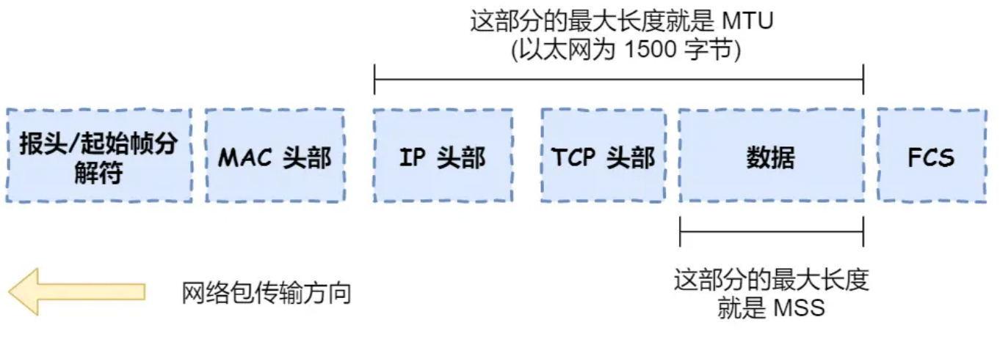

### TCP/IP网络模型

#### 应用层：应用数据

* 专注为用户提供应用功能，HTTP、FTP、Telnet、DNS、SMTP

#### 传输层：TCP头+应用数据

* TCP：流量控制、超时重传、拥塞控制 保证数据包可靠地传输给对方。数据包超过TCP最大报文长段要将数据包分块（TCP段）。接收端使用端口区分数据包。
* UDP：只负责发送数据包，不保证可靠传输

#### 网络层：IP头+TCP头+应用数据

* 数据传输的媒介
* IP：报文大小超过MTU就会再次进行分片
  * 网络号，负责标识该IP地址属于哪个子网
  * 主机号，负责标识同一个子网下的不同主机
* 路由寻址：找到目标地址的子网，找到后进而把数据包转发给对应网络
* 寻址更像在导航，路由更像在操作方向盘

#### 网络接口层：帧头+IP头+TCP头+应用数据+帧尾

* 为网络层提供「链路级别」传输的服务，负责在以太网、WiFi 这样的底层网络上发送原始数据包，工作在网卡这个层次，使用 MAC 地址来标识网络上的设备

### 输入网址到网页显示过程

#### 解析URL 生成发送给Web服务器的请求信息（生成请求）

* `http:` + `//` + `Web服务器` + `/` + `目录名` +  `/` +  `...` + `文件名`

#### DNS地址查询（获取IP）

* 客户端向本地DNS服务器询问服务器IP
* 本地DNS服务器缓存中没有，向根域询问
* 根域根据请求中的服务器中的后置，返回顶级域名服务器的地址
* 本地DNS收到顶级域名服务器地址后，发起请求询问服务器IP地址
* 顶级域名服务器返回服务器区域权威DNS服务器地址
* 本地DNS收到区域权威DNS服务器地址后发起服务器IP查询
* 权威服务器返回IP地址
* 本地DNS服务器将IP返回客户端，客户端和目标建立连接

#### 协议栈

* 负责收发数据的TCP/UDP协议
* IP协议控制网络包的收发
  * ICMP：用于告知网络包传输过程中产生的错误以及各种控制信息
  * ARP：根据IP地址查询以太网MAC地址

#### 可靠传输TCP

* TCP 报文头部格式：

  * 源端口号（16位）+ 目的端口号（16位）+ 序号（32位）+ 确认序号（32位）+ 首部长度（4位）+ 保留（6位）+ URG + ACK +PSH + RST + SYN + FIN + 窗口大小（16位）+ 检验和（16位）+ 紧急指针（16位）+ 选项 + 数据
  * 源端口号和目的端口号确认数据发送给的应用
  * 序号解决包乱序问题
  * 确认序号确认对方是否收到，没有收到就需要重发
  * 状态位：SYN发起一个连接，ACK是回复，RST是重新连接，FIN是结束连接。带状态位的包的发送会引起双方状态改变
  * 窗口大小用于流量控制，通信双方各声明一个窗口（缓存大小）标识自己的处理能力
  * 拥塞控制：网络堵车时控制自己的发送速度

* 三次握手（保证双方都用通信能力）

  * 一开始服务端和客户端都处于`CLOSED`状态，服务端主动监听某个端口，处于`LISTEN`状态。
  * 客户端主动发起连接`SYN`，之后处于`SYN-SENT`状态
  * 服务端收到发起的连接`SYN`，并且`ACK`客户端`SYN`，之后处于`SYN-RCVD`状态
  * 客户端收到服务端发送的`SYN`和`ACK`之后，发送对`SYN`确认的`ACK`，之后处于`ESTABLISHD`状态，因为一发一收成功了
  * 服务端收到`ACK`的`ACK`后，处于`ESTABLISHD`，因为它也一发一收了

* 数据分割

  * HTTP请求消息超过MSS的长度，TCP需要对数据拆解成一块块数据发送
    * MTU：一个网络包的最大长度，以太网中一般为1500字节
    * MSS：除去IP和TCP头部后，一个网络包所能容纳的TCP数据的最大长度

  

  * 数据包会被以MSS为长度进行分割，拆分出的数据包会被放进单独的网络包。也就是在每个被拆分的数据上加TCP头，然后交给IP模块进行发送

* TCP报文：浏览器监听端口（随机生成），服务器监听端口（HTTP默认80，HTTPS默认端口443），建立连接后TCP报文中的数据部分存放HTTP头部+数据

#### 远程定位IP

* IP包头：版本（4位）+ 首部长度（4位）+ 服务类型TOS（8位）+ 总长度（16位）+ 标识（16位）+ 标志（3位）+ 片偏移（13位）+ TTL（8位）+ 协议（8位）+ 首部校验和（16位）+ 源IP地址（32位）+ 目标IP地址（32位）+ 选项 + 数据
  * 源IP地址：客户端IP地址
  * 目标地址：DNS服务器提供的服务器IP
* 客户端存在多块网卡时根据路由表规则来判断哪一个网卡作为源地址IP
* IP报文=IP头部+数据【TCP头部+HTTP报文】

#### 两点传输MAC

* MAC包头格式：接收方MAC地址（48位）+ 发送方MAC地址（48位）+ 协议类型（16位）
  * 协议类型：`0800` IP协议 `0806`ARP协议
  * 发送方的MAC地址只需要从网卡中读取写入MAC包头
  * 接收方的MAC地址需要查路由表，把包发送给Gateway 列中的IP地址，通过ARP协议获取MAC地址
  * APR在系统中存在几分钟的缓存，在发送时优先查询ARP缓存中查询

#### 网卡

* 网卡驱动将网络包复制到网卡内缓存中，在其开头加上报头和起始帧分界符，在末尾加上用于检测错误帧校验序列
  * 起始帧分界符是一个用来表示包起始位置的标记
  * FCS（帧校验序列）用来检查包传输过程是否有损坏

#### 交换机

* 根据MAC地址表，将信号发送到对应端口
* MAC地址表中找不到指定MAC地址时，发送到除源端口的所有端口（只有相应的接收者才会接收包，而其他设备会忽略这个包）

#### 路由器

* 路由器是基于IP设计的，各个端口具有IP地址和MAC地址
* 交换机是基于以太网设计的，端口不具有MAC地址
* 转发包时，路由器端口会接收发送给自己的以太网包，然后路由表查询转发目标，再相应的端口作为发送方将以太网包发送出去
* 接收包时，电信号到达网线接口部分，路由器中的模块将电信号转换为数字信号，通过包尾的FCS进行错误校验。没有问题则检查MAC头部中的接收方MAC地址，是发送给自己的包则放入缓冲区，否则丢弃
* 接收包完成后去掉MAC头，根据IP头部信息进行转发操作。首先是路由表判断转发目标，接下来进入包的发送操作，根据路由表的网关列判断对方的地址。如果网关是一个IP地址则这个IP地址是要转发到的目标地址，即需要继续转发给下一个路由器。如果网关为空，则IP头部接收方IP地址位目标地址，说明抵达终点，通过ARP协议查询MAC地址

#### 网络模型

* OSI网络模型
  * 应用层：给应用程序提供统一接口
  * 表示层：将数据转换成兼容另一个系统能识别的格式
  * 会话层：建立、管理和终止表示层实体之间的通信会话
  * 传输层：端到端数据传输
  * 网络层：数据的路由、转发、分片
  * 数据链路层：数据的封帧和差错检测及MAC寻址
  * 物理层：物理网络中传输数据帧
* TCP/IP网络模型
  * 应用层：向用户提供一组应用程序，HTTP、DNS、FTP等
  * 传输层：端带端通信，TCP、UDP等
  * 网络层：网络包的封装、分片、路由、转发，IP、ICMP等
  * 网络接口层：网络包在物理网络中的传输，网络包的封帧、 MAC 寻址、差错检测，以及通过网卡传输网络帧等
